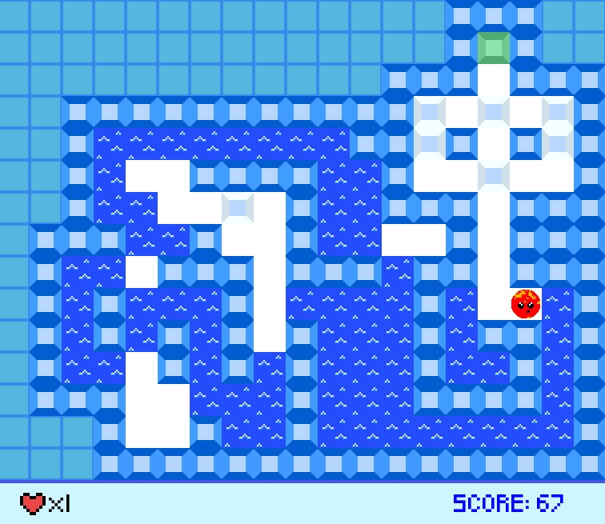

# Thin Ice — Club Penguin 🐧🧊

Recreation of **Thin Ice**, a Club Penguin minigame. It was made in 2018 for an Object-Oriented Programming course in an integrated technical program in Computer Science.



## 🚀 How to play

The project uses **Python 3.13.x** and **pygame 2.6.x**. `mise.toml` selects the latest Python 3.13 patch release, and `requirements.txt` allows pygame updates within the 2.6 series.

From the project root, install the dependencies and run the game:

```bash
mise install
make install
make run
```

The Makefile creates a `.venv` using the Python version selected by [mise](https://mise.jdx.dev/) and installs the dependencies there.

### 🎮 Controls

```text
       [^]
   [<] [v] [>]

   [Esc] Quit
```

> Run the game from the project root: the code uses relative paths to load levels, images, the font, and music.

## 📁 Project structure

| Path | Contents |
| --- | --- |
| `Thin Ice.py` | Main game code and entry point. |
| `Levels/` | Text files containing the level maps. |
| `Textures/` | Images for the player, scenery, and scoreboard. |
| `Sounds/` | Game music. |
| `Fonts/` | Font used in the interface. |
| `game_preview.jpg` | Preview image shown in this README. |
| `requirements.txt` | Python dependency (`pygame~=2.6.0`). |
| `mise.toml` | Python 3.13.x for mise users. |
| `Makefile` | Commands to set up the virtual environment and run the game. |
